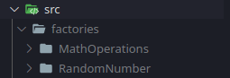

# Projeto Simples Typescript TDD Factory

O intuito deste projeto é criar um projeto simples, utilizando typescript e com o Design Pattern chamado [Factory](https://www.devmedia.com.br/design-patterns-factory/17158), utilizando testes automatizados com JEST e prática de TDD.

Foi criado um software simples para realizar operações básicas de matemática, soma, subtração, multiplicação e divisão entre dois números.

# Para rodar

Para rodar o projeto, há dois scripts dentro do arquivo package.json, sendo eles:

- compile: para compilar o arquivo para javascript;
- test: para testar o código, se está funcionando adequadamente;

1. Rode o `yarn compile` para compilar o código.
2. Execute na linha de comando o seguinte código:　`node src/run.js`

# Organização do projeto

O arquivo principal do software é o "main.ts", no qual faz a chamada de todos os outros arquivos, e o run.ts faz a execução do main.

# Factory

A pasta factory está localizada dentro de "src", na qual possui duas outras factories, uma responsável de criação dos números aleatórios, e outra responsável por realizar as operações.

Dentro destas pastas contém os arquivos de teste e de cada factory em conjunto com a pasta de tipos.
